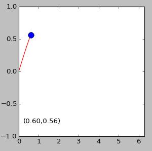

# Animaties

Hoewel een grafiek heel handig kan zijn om een simulatie te visualiseren is het
soms inzichtelijker een animatie te maken. Python biedt je de mogelijkheid om
een figuur steeds opnieuw te tekenen. Dat geeft je verschillende mogelijkheden
om een beweging aan te geven. We bouwen hier een kort voorbeeld, waarin we een
lijn (en punt) volgens $$f(x)=\sin(x)$$ over het scherm laten bewegen. We bouwen
de functie op in drie stappen waarbij we telkens één element toevoegen. Met behulp
van deze functionaliteit kun je een groot scala aan animaties maken.

## Een bewegend stipje 

Als je een punt tekent (één $$x$$-waarde en één $$y$$-waarde) waarvan je $$x$$
en $$y$$ steeds verandert dan lijkt het of het punt over het scherm beweegt. In
de code hieronder nemen we steeds stapjes in $$x$$, rekenen $$y$$ uit en
tekenen het punt op het scherm. We gebruiken ook de commando's `xlim` en `ylim`
om in de plot aan te geven welke $$x$$-waardes en $$y$$-waardes we willen zien.

    import numpy as np
    import matplotlib.pyplot as plt
    
    # x neemt kleine stapjes tussen 0 en 2pi
    for x in np.arange(0, 2 * np.pi, 0.05):

        y = np.sin(x)

        # plot grafiek
        plt.plot(x, y, 'bo', markersize = 10)  <-- blauwe punt
        plt.xlim(0, 2 * np.pi)
        plt.ylim(-1, 1)
        plt.draw()           <-- update grafiek
        plt.pause(0.001)
        plt.clf()            <-- 'clear' grafiek

> Je ziet dat we in de code de functie `pause()` aanroepen. Dat doen we om pyplot de gelegenheid te geven de nieuwe figuur op het scherm te tekenen. Dit wordt alleen gedaan tijdens de pauzes die we geven.

## Een bewegende lijn

Een grafiek tekenen we met behulp van lijsten: een lijst met $$x$$-waardes en
een lijst met $$y$$-waardes. Als je die lijsten steeds uitbreidt dan krijg je
het onderstaande effect: de functie $$f(x) = \sin(x)$$ getekend met een rode
lijn.

    import numpy as np
    import matplotlib.pyplot as plt
    
    L_x, L_y = [], []

    # x neemt kleine stapjes tussen 0 en 2 pi
    for x in np.arange(0, 2 * np.pi, 0.05):

        y = np.sin(x)

        L_x.append(x)
        L_y.append(y)

        # plot grafiek
        plt.plot(L_x, L_y, 'r-')   <-- rode lijn
        plt.xlim(0, 2 * np.pi)
        plt.ylim(-1, 1)
        plt.draw()
        plt.pause(0.001)
        plt.clf()

Zoals je ziet is de code maar drie regels veranderd ten opzichte van voorbeeld
1. Het resultaat ziet er als volgt uit:

## Een stip, een lijn en tekst

Je kan de stip en de lijn ook tegelijk tekenen en op het scherm ook informatie
weergeven over de $$(x,y)$$ positie van het punt op het scherm.

    import numpy as np
    import matplotlib.pyplot as plt
    
    L_x, L_y = [], []

    # x neemt kleine stapjes tussen 0 en 2 pi
    for x in np.arange(0, 2 * np.pi, 0.05):

        y = np.sin(x)

        L_x.append(x)
        L_y.append(y)

        # plot grafiek
        plt.plot(L_x, L_y, 'r-')
        plt.plot(x, y, 'bo', markersize = 10)
        plt.xlim(0, 2 * np.pi)
        plt.ylim(-1, 1)

        # text op scherm
        plt.text(0.25, -0.8, "(%.2f, %.2f)" % (x, y) )

        plt.draw()
        plt.pause(0.001)
        plt.clf()

